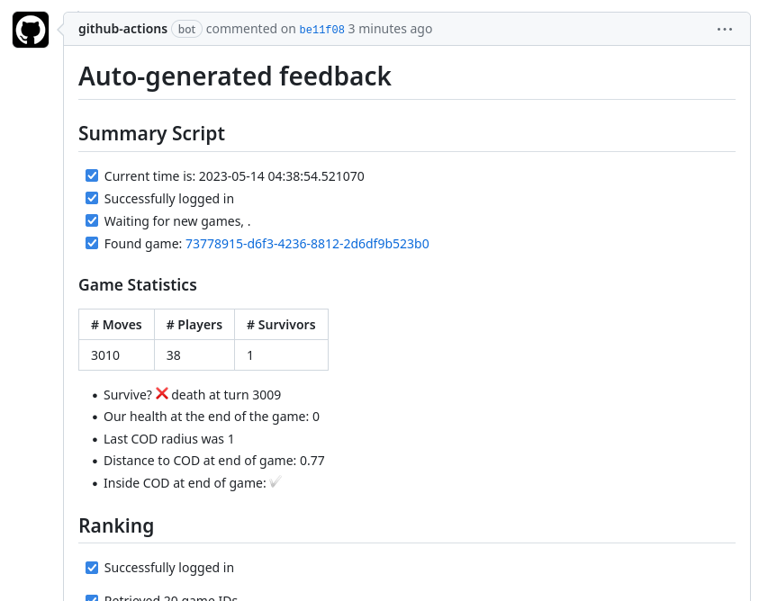

# Voyager

## By OutLauz

_SQLillo Royale: where agents fight to the death. Using efficient & novel approaches for obstacle evasion, target acquirement and action choices, we achieve top performance on the battlefield._

[Github](https://github.com/lucashc/Voyager) - [Devpost](https://devpost.com/software/voyager-o6dauy) - [Visualisation](https://imgur.com/Oa0ycdO)

## Inspiration
For many complex problems, often machine learning approaches are thrown at them without much thought or understanding of the underlying processes. However, well thought-out heuristics are often better and more efficient approaches. With this in mind, we demonstrate that our approach, based on some novel heuristics, is able to outperform our competitors.
## What it does
Voyager is an agent, optimised for playing SQLillo Royale, a Fortnite-inspired battle royale game. We are able to achieve top level performance using a number of sophisticated mathematical approaches such as exponential smoothing, linear algebra, offline planning and more. With these tools, we are able to develop efficient new algorithmic process for dodging mechanics, target analysis and situational intelligence.
## How we built it
The main algorithms are implemented in Lua with JIT, analysis has been undertaken with Python, and we also make extensive use of Github actions for automation. 
## Challenges we ran into
Developing good heuristics requires intuition and deep knowledge of the game mechanics, in addition to the ability to formulate such heuristics as an optimisation problem to transfer to code. Another challenge was remote debugging without any logs since the code was running on a restricted remote server.
## Accomplishments that we're proud of
None of us had any experience coding in Lua, so developing a highly performant algorithm for this game was a great accomplishment. We are also very proud of our Github actions pipeline we created, which streamlined the process of uploading our agents to the server, as well as calculating analytics and feedback on the agent's performance directly.
## What we learned
Lua, Github Actions, Game Mechanics

## Further Github Details
We used a private GitHub repository to collaborate on our code, and extensively used different branches and pull requests to coordinate our efforts. In particular, we learned about GitHub Actions's powerful automation capabilities, and created a workflow to make our lives easier. Our project required uploading code onto a server to evaluate its performance. This would normally be a very manual process, but using GitHub Actions we were able to automatically upload our code after each push. After uploading the code, the workflow also generated a comment on the commit, with a summary of our agent's performance.

Our workflow looks as follows:

We push up our changes with `git push`. The code is automatically pushed to the remote server, and we also monitor the performance metrics of this code over the next few games. The results are outputted as a commit message.

## Further Algorithmic Details
Our algorithm can be broadly thought about in 3 main blocks.
- [x] Obstacle avoidance: we solve a discrete constrained optimisation problem in order to calculate the optimum position to move to in order to avoid obstacles. Specifically, we attempt to maximise the perpendicular distance to the bullet trajectories, prioritising bullets that are closer to the user. That is, we attempt to find a new co-ordinate $\boldsymbol{x} = (x,y)$ given the current co-ordinate $\boldsymbol{x}_C$, equations of $n$th bullet trajectories $a_n x + b_n y + c_n=0$, bullet co-ordinates $\boldsymbol{b}_n$ by solving the following problem
$$\max_{||\boldsymbol{x} - \boldsymbol{x}_c||=1} \sum_n d(\boldsymbol{x}_C, \boldsymbol{b}_n) \frac{|a_n x + b_n y + c_n|}{\sqrt{a_n^2 + b_n^2}} $$
where we only consider bullets travelling towards us, and $d(\boldsymbol{x}_C, \boldsymbol{b}_n)$ is a distance function.

- [x] Enemy avoidance: we use a number of different evaluation metrics in order to evaluate how dangerous each opponent player is. Namely, they are as follows:
    - [x] Proximity: how close the enemy is
    - [x] Mobility: how much the enemy moves
    - [x] Aggression: how much the enemy shoots
    - [x] Direction: if the enemy is moving towards us

- [x] Zone of death: we use an exponential scaling of the distance to the safe zone in order to ensure that our agent does not die from the zone of death.

- [x] Spellcasting: we also implement action choices based on some useful heuristics. Some key considerations are
    - [x] Are we in danger to be attacked with melee attacks? If so, perhaps we should dash.
    - [x] Are we in melee range? If so, perhaps we should melee
    - [x] Otherwise, shoot
    Choosing the optimal player to shoot is done in a similar fashion to enemy avoidance i.e. we target enemies that we consider as dangerous.